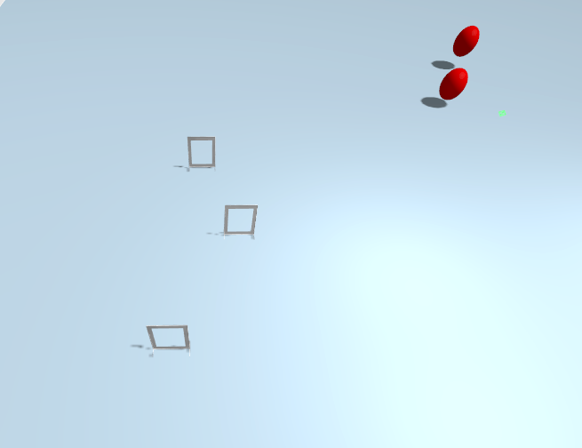

# examU2035

# Полетное задание:
От вас требуется пройти полосу препятствий. Всего на карте 2 испытания. GPS-координаты начала каждого испытания: 

[-8.53114075e-07, -3.51647797e-06, 2] - координаты начала испытания с воротами

[3.24710903e-06, 2.46968846e-07, 3] - координаты начала испытания со сферами

#### Испытание с воротами:
Перед дроном стоят трое ворот, нужно пролететь через все по порядку, начиная с ближайшего к точке старта.

#### Испытание со сферами:
Перед дроном 2 сферы. Нужно долететь до финиша, не задев ни одну сферу. Финишная черта находится на координате по y = 37.0.

# Как вылгядет карта:

